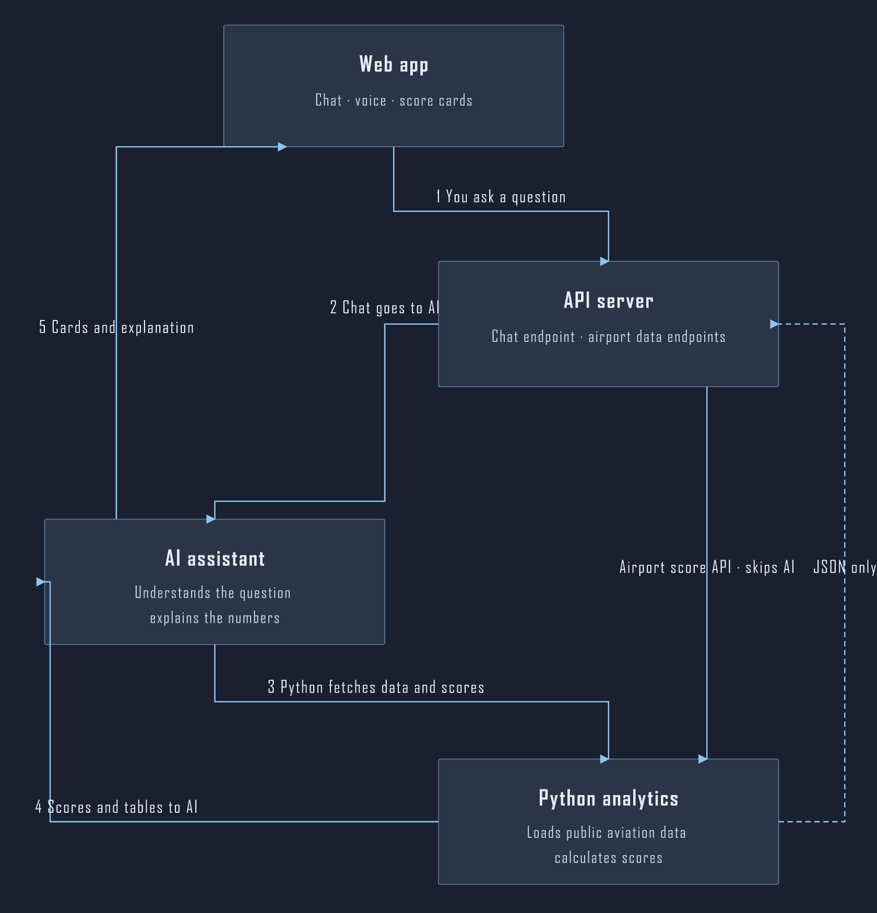

# AirportIQ

Ask questions about **US airport expansion pressure** in plain language. You get score cards and rankings first, then a short explanation. All numbers come from **Python and public aviation data**. The AI helps you ask and explains results. It does not invent scores.

## About the project

AirportIQ is a small demo app for analysts and investors who want a quick read on demand, congestion, delays, and capacity **pressure** at supported US airports. Chat is optional. The same scores are available from the REST API without the LLM.

<p align="center">
  
</p>

## Install and run

**You need:** Python 3.10+, Node.js 18+, [uv](https://docs.astral.sh/uv/), and an OpenAI API key (for chat only).

1. Clone the repo and copy the env file:

   ```powershell
   copy .env.example .env
   ```

   Edit `.env` in the **repo root** and set `LLM_API_KEY`.

2. Install and start (from the **repo root**):

   ```powershell
   cd backend
   uv sync
   cd ..
   npm install
   npm run dev
   ```

3. Open the app:

   - **UI:** http://localhost:5173
   - **API docs:** http://localhost:8000/docs

**Optional:** Put BTS CSV files under `backend/data/` and set paths in `.env` for richer delay and long-haul metrics. See [`.env.example`](.env.example).

## Learn more

[docs/architecture.md](docs/architecture.md): design, scoring, guardrails  
[docs/README.md](docs/README.md): full documentation index

Scores describe operational **pressure**, not financial ROI. Not investment advice.