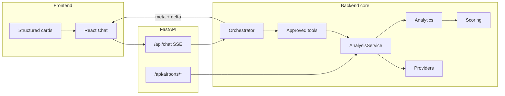
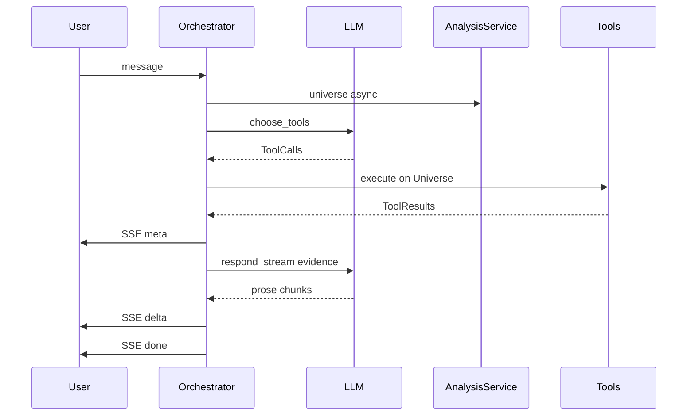

# AirportIQ system design document

## 1. Problem and product boundary

**Problem:** Analysts ask free-form questions about US airport **expansion pressure**; every number must be Python-computed from public-ish aviation data.

**Peer universe (9 airports):** BOS, BDL, PVD, PWM, LAX, SNA, ANC, SFO, JFK ([`models/airport.py`](../backend/app/models/airport.py)).

**Two entry points:**
- **Chat:** SSE [`POST /api/chat`](../backend/app/api/chat.py) → [`Orchestrator.turn_stream`](../backend/app/agent/orchestrator.py)
- **REST (no LLM):** [`airports.py`](../backend/app/api/airports.py) → same `AnalysisService.universe()`

*(For embedding in READMEs or external docs, use the rendered [assets/airportiq-architecture.svg](assets/airportiq-architecture.svg))*

## 2. Layer responsibilities

- **API:** validation + delegation only. Must not contain scoring formulas or aviation API logic.
- **Agent:** intent, tool selection, prose, session memory, guardrails. **No formulas.**
- **Tools:** thin projections over `Universe` ([`tools.py`](../backend/app/agent/tools.py), 12 tools).
- **AnalysisService:** TTL-cached **Universe** build — fetch, merge, dossier, score ([`analysis_service.py`](../backend/app/services/analysis_service.py)).
- **Analytics:** pure deterministic KPIs and proxies.
- **Scoring:** normalization + weighted opportunity index.
- **Providers:** fetch + normalize; **CompositeProvider** live-then-sample merge ([`fallback.py`](../backend/app/providers/fallback.py)).
- **Frontend:** render API payloads; **no business math** ([`AirportScoreCard.tsx`](../frontend/src/chat/AirportScoreCard.tsx) etc.)

## 3. Data model and provenance

- **`Present` / `Absent` pattern on `DatumFloat`:** Missing values stay missing (never coerced to zero for scoring).
- **`Origin` folding:** Each computed field carries **method**, **proxy** flag, **assumption**, and **source** lineage.
- **`PeerStats`:** min/max bounds computed across the frozen peer set at universe build time ([`_build_peer_stats`](../backend/app/services/analysis_service.py)).
- **`Universe`:** immutable snapshot (`snapshot_at`, dossiers, scores, peers, failures); tools and REST both read the same object.
- **TTL:** `UNIVERSE_TTL_SECONDS` ensures rankings are consistent within a snapshot window.

## 4. Scoring methodology

### 4.1 Expansion Opportunity Score (0–100)

Canonical weights **only** in [`SCORING_WEIGHTS`](../backend/app/scoring/expansion_score.py):

| Component | Weight | How computed |
|-----------|--------|----------------|
| **Demand growth** | 30% | YoY passenger growth → min-max vs peer `demand_growth` bounds |
| **Congestion** | 30% | Proxy from ops, delay %, pax vs peers; +10 if FAA NAS GDP active |
| **Delay pressure** | 20% | 0.6 × delayed % + 0.4 × (avg delay min / 60 × 100), renormalized if one input missing |
| **Capacity pressure** | 20% | 0.6 × pax/op utilization (peer-normalized) + 0.4 × growth component when growth present |

**Aggregation rules:**
- Each component normalized to 0–100 ([`normalization.py`](../backend/app/scoring/normalization.py)).
- **Missing components:** weights **redistributed** across present components (`_weighted_opportunity`). Score is still defined, but confidence drops.
- **Ranking:** [`rank()`](../backend/app/scoring/expansion_score.py) — absent opportunity sorts last.

### 4.2 Sub-formula detail

- **Demand:** [`calculate_passenger_growth`](../backend/app/analytics/demand.py) — `(current − previous) / previous`
- **Congestion:** [`calculate_congestion_score`](../backend/app/analytics/congestion.py) — 0.5 ops + 0.3 delayed + 0.2 pax (renormalized if inputs missing) + GDP bump
- **Delay:** [`calculate_delay_pressure`](../backend/app/analytics/congestion.py)
- **Capacity:** [`calculate_capacity_pressure`](../backend/app/analytics/capacity.py)

### 4.3 Related indices

- **Unmet demand index:** separate proxy, 50% growth + 25% delay + 25% congestion ([`opportunity.py`](../backend/app/analytics/opportunity.py)). Used by `get_unmet_demand` / `explain_unmet_demand`, **not** in opportunity weight sum.
- **Long-haul %:** departures-based from merged metrics; BTS T-100 for richer destination reports on demand.
- **Simulation:** [`Universe.simulate`](../backend/app/services/analysis_service.py) — adjusts passenger growth by user `pct`, re-runs `score_dossier` against **same** peer bounds.

### 4.4 Confidence

[`calculate_confidence`](../backend/app/scoring/expansion_score.py): HIGH if core metric completeness ≥ 1.0 and all four components present; LOW if completeness < 0.8 or < 3 components; else MEDIUM.

### 4.5 Explain tools

[`drivers.py`](../backend/app/analytics/drivers.py) exposes **driver breakdowns** matching proxy formulas for `explain_congestion`, `explain_capacity_pressure`, `explain_unmet_demand` as a narrative aid tied to the same math.

## 5. Data sources and ingestion

- **Live:** OpenSky (OAuth), FAA NAS (delay programs)
- **File/cache:** FAA ACAIS enplanements, FAA ATADS operations, OpenFlights routes, BTS T-100, OurAirports coords
- **Fallback:** `SampleProvider` after live attempts — failures recorded in `ProviderFailure` list on Universe
- **Merge:** `merge_outcomes` / `merge_context_outcomes` — first-wins or ordered merge per field (see [`base.py`](../backend/app/providers/base.py))

## 6. Where and how AI is used

### 6.1 LLM responsibilities

| Phase | Location | Behavior |
|-------|----------|----------|
| **Tool selection** | `_llm.choose_tools` | OpenAI-style function calling over fixed `TOOLS` registry |
| **Explanation** | `_llm.respond_stream` | Streams prose after **`meta` event** ships structured evidence |
| **TTS (optional)** | [`tts_service.py`](../backend/app/services/tts_service.py) | OpenAI speech API — **not** analytical |

### 6.2 Deterministic companions (AI-adjacent, not LLM)

- **Input:** `screen_input` — injection notes, voice low-confidence confirm ([`guardrails.py`](../backend/app/agent/guardrails.py))
- **Mention resolution:** alias map + IATA scan (deterministic)
- **Conversation frame / airport scope:** [`airport_scope.py`](../backend/app/agent/airport_scope.py), [`session.py`](../backend/app/agent/session.py) (max 6 exchanges, TTL)
- **Fallback tool plan:** if LLM picks no tools, [`plan_fallback_tools`](../backend/app/agent/follow_up.py)
- **Output:** `verify_numbers` — warn when prose contains numbers not in evidence JSON; `scrub_guarantees` disclaimer

### 6.3 Chat turn sequence (SSE)

1. Input screen → optional confirmation
2. Start `universe()` task in parallel with LLM tool select
3. Coalesce / reconcile tool calls; optional `rank_region` injection
4. Execute tools on thread pool → `ToolResult` evidence
5. Evidence display selection (new vs carried)
6. **`meta` event** (structured cards) → **`delta` events** (prose) → **`done`**
7. Output screen + session append + `TurnAudit` log

### 6.4 Explicit "AI DOES NOT" list

- Invent data or KPIs.
- Calculate final scores or percentages.
- Independently rank airports.
- Guess values when data is absent.
- Call direct external API requests from the LLM.

## 7. Key tradeoffs

| Tradeoff | Choice | Benefit | Cost |
|----------|--------|---------|------|
| **Peer normalization** | Fixed 9-airport universe | Comparable scores/rankings within demo scope | Not nationally representative; bounds shift when peers change |
| **Capacity/congestion** | Operational proxies vs terminal square footage | Works with public FAA/OpenSky data | Not literal physical capacity; must label proxies in UI |
| **Opportunity vs ROI** | Pressure index, not NPV | Honest scope for MVP | Cannot answer "will this project pay back?" |
| **Live + sample merge** | CompositeProvider | Resilient demos when APIs fail | Mixed freshness; warnings/failures must be read |
| **No RAG** | Structured data only | Deterministic, testable | No citations from master plans/EIS PDFs |
| **In-memory sessions** | TTL SessionStore | Simple deployment | No cross-device history |
| **LLM + deterministic fallback** | Dual tool routing | Robust follow-ups | Two paths to maintain; doc must describe both |
| **SSE meta-before-delta** | UI shows numbers before prose finishes | UX trust | Client must handle partial stream |

## 8. Guardrails summary

- **Data Integrity:** No fabricated data (missing is missing), Tool-grounded numbers, Source transparency, Deterministic score protection, Missing/conflicting data fallback.
- **Security/Input:** Input validation via Pydantic, Prompt injection resistance, Read-only agent permissions, API protection (timeouts/retries).
- **Voice:** Voice confirmation for ambiguous speech.
- **Disclaimers:** Data freshness warnings, Assumption disclosure (e.g. for proxies), Programmatic confidence (HIGH/MEDIUM/LOW), No investment guarantees.
- **Audit:** Auditability (turn-by-turn logging via TurnAudit).

## 9. Frontend contract

- Chat consumes SSE phases; structured payload in `meta` / `done`.
- Cards keyed by `ToolResult.kind` (score, comparison, ranking, simulation, etc.).
- REST consumers get same `AirportScore` / `RankingResult` models without agent layer.